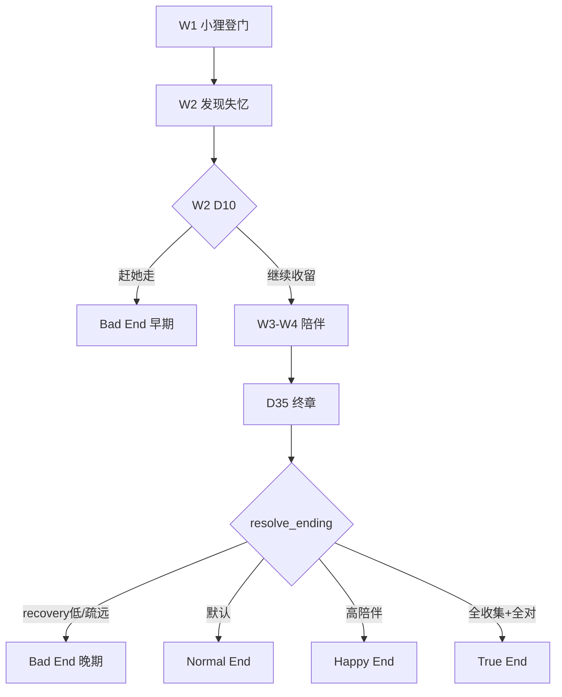

# 《河可松》主线剧情 · 设计稿

**创作动机**：纪念现实中陪伴过我们的 furry 伙伴；写**失去与重逢**——它们换了一种样子回家。  
**游戏表达**：不追求医学意义上的「痊愈」，而是写**陪伴如何让记忆一点点回来**——像光透进雾，慢、碎、但真实。

**核心句**（来自世界观设定）：

> 有些告别，并不是终点。它们只是换了一种样子，循着心底那点温柔的熟悉感，重新找到了回家的路。  
> 这是你自己的农场。有一天，小狸出现在门边，记忆支离破碎，却觉得这里就是该留下的地方。  
> 你留下了她，却慢慢发现她会遗忘——那不是 bug，而是她的一部分；  
> 你没有赶她走，她便在一次次帮工与说话里，慢慢想起了你。

---

## 〇、世界与角色设定（v0.5 · 对齐《设定.pdf》）

### 归属与身份


| 角色     | 身份       | 与农园的关系                              |
| ------ | -------- | ----------------------------------- |
| **玩家** | 农场主人     | 独自守着萝卜田与旧屋；曾失去一只陪伴多年的 furry，把思念藏进日常 |
| **小狸** | 来投宿的狐狸伙伴 | 从外走来，记忆断裂；在此找到「该留下的地方」，帮工换食宿，住在树洞   |


### 设定真相（设计用 · D35 前不对玩家直说）

- **它一直都是它**：小狸是玩家逝去伙伴的灵魂，依附在新机体上归来；记忆拼不齐，但情感从未真正断开。  
- **隐藏记忆层**：W2～W4 的「似曾相识」来自灵魂深处——并非真忘，只是暂时拼不回。  
- **七日记忆重置**：叙事化的「记忆缺失 / 系统故障」，不是玩法 bug。  
- **W5 觉醒**：拼起全部陪伴记忆，认出玩家；**七日法则解除**，成为真正挚友。

### 小狸为何留下

1. **引路**：循着内心指引走到玩家的门前后，看见萝卜田与旧屋感到安心。
2. **请求**：提出帮种萝卜、浇水、跑腿，换一口安定。
3. **熟悉感**：玩家望向她时有说不清的熟悉，点头留下：「那就……留在这里吧。」
4. **后来**：发现她周期性遗忘后，留下她不再只是「多个帮手」——而是**选择继续收留与陪伴**。

### 失忆由谁发现

- **W1**：玩家偶觉小狸记错昨天的事（重复问、搞混块田），**不确定**。  
- **W2 D8–D10**：小狸完全不认玩家 → 玩家找到**小狸自己记的日常本子**（日期乱、对不上）→ **确认：她会周期性遗忘**。  
- **W3 起**：玩家是知情者；每周重新接纳她；小狸在帮工与聊天中**慢慢记起**「这个农场、这个收留自己的人」。

### 情感双轨


| 轨道      | 讲什么                                                |
| ------- | -------------------------------------------------- |
| **玩家线** | 空荡家园 → 收留小狸 → 起疑 → 发现失忆 → 选择不赶走 → 见证她记起你           |
| **小狸线** | 漂泊 → 在此安顿 → 遗忘 → 碎光 → 拼凑 → 记起「{player_name} 让我留下来」 |


### 与玩法的对应


| 玩法行为          | 叙事含义                       |
| ------------- | -------------------------- |
| 种 / 浇 / 收 / 卖 | **你的**农活；小狸来帮工             |
| 派小狸浇水         | 羁绊加深后，更愿为你分担（§羁绊系统）        |
| 聊天            | 从「谈工换宿」到「像家人一样说话」；忘了我，就重来  |
| 投喂            | 主人犒劳帮手；后期成为记忆触媒            |
| 跨周仍收留         | **核心坚持**：知道她会忘，仍让她留下、仍一起过日 |


> 配置文件：`config/worldview_setting.json` · `config/xiaoli_persona.json`

---

## 一、情感弧线（五幕 · 35 天）


| 周目  | 天数     | 幕名     | 小狸的记忆       | 玩家（农场主）的处境                       |
| --- | ------ | ------ | ----------- | -------------------------------- |
| W1  | D1–7   | **收留** | 完整；记得是你让她留下 | 小狸登门；你答应让她帮工；偶觉她记错细节             |
| W2  | D8–14  | **发现** | 几乎清零；不认你    | **确认她失忆**；仍留她在农场；最痛的一周           |
| W3  | D15–21 | **碎光** | 偶发碎片        | 知情陪伴；她隐约觉得「在这干过活、有个人对我很好」        |
| W4  | D22–28 | **拼凑** | 细节仍乱，情感渐准   | 她叫出 `{player_name}`；你是「让她安顿下来的人」 |
| W5  | D29–35 | **归来** | 大段记忆连续      | 她记起为何留下、谁收留了她；碎片揭示完整故事           |


**记忆恢复规则（叙事）**：

- 小狸：**先感受 → 再场景 → 最后名字与关系**（先记起「有个农场、有个让我留下的人」，再记起 `{player_name}`）
- 玩家：**坚持不懈** = 明知她会忘，仍留她在农场、仍一起干活、仍对话 → 驱动 `memory_recovery`（见 §四）
- 农园归属不变：恢复记忆后，**农场仍是玩家的**；小狸是**被记起的家人式帮手**，在这里找到了家

---

## 二、完整故事（由结尾碎片揭示）

> 以下对玩家 **D35 前不可直说**，只通过碎片与渗漏暗示。  
> 叙述视角：F10 闪回为**全知蒙太奇**；日常游玩以**玩家有限视角**推进。

**背景**

这片萝卜田和旧屋，是**你的**农场。你独自守着它很久了——曾有一只 furry 陪你看遍四季，它离去后，你把思念藏进日常。  
农场边上有树洞——小狸后来住在那。她循着说不清的指引走到门前后，记忆支离破碎，却觉得**这里就是该留下的地方**。  
她怕再漂泊，习惯把每天帮工的事写进小本子——后来本子上的日期开始乱，她开始忘。  
（设定真相：她是你逝去伙伴的灵魂归来；D35 前只暗示，不直说。）

**小狸从哪里来（不必讲太细）**

雨夜 / 清晨，她出现在田埂上：「我在外头走了很久……能帮你干活吗？我只想有个地方安定下来。」  
你望向她，有说不清的熟悉，点头留下。

**完整故事（碎片 F01–F10 拼出）**

1. **【登门】** 她第一次来，浑身风尘。你说可以留下，条件是帮忙把田照顾好。
2. **【第一粒种】** 她学你的节奏种萝卜、浇水。你说：「慢也没关系。」她答：「嗯，我想在这里慢慢来。」
3. **【约定】** 某个傍晚，萝卜将熟。你说：「等长好了，一起看看。」她记进了本子里。
4. **【起雾】** 你发现她重复问、记错块田；夜里听见她说：「对不起，我好像把什么弄丢了。」
5. **【发现】** 新一周，她问：「你是谁？我怎么会在这？」——你对照她的本子，**确认：她会忘。** 你没有赶她走。
6. **【坚持】** 你仍让她帮工、仍给她一口饭吃、仍在她忘你之后重新介绍自己。
7. **【归来】** 第五周最后一日，她看着田和你：「我想起来了……是你让我留下来的。**{player_name}**，谢谢你没赶我走。」

**主题落点**

- 玩家线：失去之后仍选择**收留与陪伴**；发现失忆后**选择不驱逐**
- 小狸线：灵魂循着爱回家；忘了，又被你一次次接回来
- 共同落点：**从未离开**——爱被重新记住了；农场仍是你的，但她在这里有了「家」

---

## 三、回忆碎片系统（D35 总揭示）

### 3.1 碎片一览（共 10 枚）

> 每枚碎片的「骨架固定 / 内容个性化」分工见 **§10.3 接法 C**。


| ID  | 标题     | 解锁周目   | 解锁条件（固定节点）        | 碎片内容（摘要）               |
| --- | ------ | ------ | ----------------- | ---------------------- |
| F01 | 登门     | W3 D16 | 雨天 session 固定场景   | 小狸请求留下帮工               |
| F02 | 第一粒种   | W3 D18 | 首次跨周认出萝卜田         | 在你的田上一起种               |
| F03 | 小狸的本子  | W3 D21 | 周结算后找到旧本子         | 你发现日期乱了——失忆物证          |
| F04 | 傍晚的约定  | W4 D23 | 复述 W1 约定（细节错、情绪对） | 「你的田，我们一起照看」           |
| F05 | 弄丢的东西  | W4 D25 | 小狸夜坐树洞固定事件        | 她怕弄丢「刚找到的安定」           |
| F06 | 你没有赶她走 | W4 D27 | 亲密度/坚持天数达标        | 明知会忘，仍留她在农场            |
| F07 | 名字     | W5 D30 | 正确叫出玩家名           | 「让我留下来的 {player_name}」 |
| F08 | 信的第一页  | W5 D32 | 找到「写给自己的信」        | 她预感到会忘：「要对农场主好一点」      |
| F09 | 信的后半   | W5 D34 | 读完信               | 「谢谢你收留我、替我记得」          |
| F10 | 完整的家   | W5 D35 | 觉醒演出终章            | 全集闪回：你的农场，她的安顿，她的记起    |


### 3.2 呈现方式

- **获得时**：短全屏插画（或文字卡）+ 收录进「记忆」面板新页签「碎片」
- **D35 终章**：按 F01→F10 顺序自动播放（可跳过单张，不可跳过 F10）
- **F10 后**：可选片尾——「献给那些记得的人，和那些被记得的人」

### 3.3 与现有系统衔接


| 现有                        | 改造                                               |
| ------------------------- | ------------------------------------------------ |
| `LeakageEngine`           | W3+ 渗漏台词改为 **碎片解锁的前奏**                           |
| `awakening_panel.gd`      | 三步改为 **碎片蒙太奇 + 小狸独白**                            |
| `day_journal` / `anchors` | 闪回素材；F10 优先引用玩家真实 journal                        |
| `long_term_memory`        | 新增 `memory_fragments: []`、`memory_recovery: 0.0` |


---

## 四、记忆恢复进度（玩法绑定）

`**memory_recovery`**：0.0 → 1.0，只增不减。


| 行为                 | 增量         | 说明         |
| ------------------ | ---------- | ---------- |
| 跨天登录（含 W2 仍收留）     | +0.04      | 明知会忘仍让她留下  |
| 完成 W1 约定           | +0.08      | 一次性        |
| W2 发现失忆后仍对话 ≥3 次/天 | +0.03/天    | 重新自我介绍，不指责 |
| 完成当周最后一天周结算        | +0.05      | 每周坚持       |
| 触发固定剧情节点           | +0.06~0.10 | 见 §五节点表    |
| 缺席 ≥2 天未玩          | −0（不扣）     | 不惩罚，但无增量   |


**阈值与叙事**：


| recovery | 小狸表现                               |
| -------- | ---------------------------------- |
| 0.0–0.2  | W2 陌生；玩家**已确认失忆**；W3 偶发 déjà vu    |
| 0.2–0.5  | 叫不出名，但识得「在这帮过工」的习惯                 |
| 0.5–0.75 | 能叫名字；细节仍常错                         |
| 0.75–1.0 | W5 大段连续记忆；D35 前需 ≥0.85 才触发「完整归来」台词 |


> 设计意图：即使用户操作少，固定节点也会推 recovery 到 ~0.7，保证能通关；**多陪伴 = 更多碎片台词变体 + 更暖的 F10 闪回**。

---

## 五、20 节点 · 每日节拍（固定主线）

> **P** = 必触发剧情（脚本锁死） · **V** = AI 可润色变量钩子  
> P 节点的 `{变量槽}` 与 fallback 见 **§10.5**。

### W1 · 收留


| 日   | 节点   | 类型  | 情绪任务 | 必触发内容                                 |
| --- | ---- | --- | ---- | ------------------------------------- |
| D1  | N01  | P   | 登门   | 小狸：「我漂泊很久，能帮你干活吗？只想安定下来。」玩家留下她，教认田、浇水 |
| D2  | N02  | V   | 日常   | 雨天廊下；小狸：「有屋顶真好……我会把田看好的。」             |
| D3  | N03  | V   | 日常   | 黄昏看**你的**田；小狸学你的节奏                    |
| D4  | N01′ | V   | 伏笔   | 小狸记错昨天是否浇过某块田（玩家可留意）                  |
| D5  | N11  | P   | 约定   | 帮工有成果：「等萝卜长好了，一起看看。」                  |
| D6  | N12  | P   | 兑现   | 约定进行中；萝卜近熟                            |
| D7  | N04  | P   | 第一周末 | 周结算 + 「明早可能有点不太一样」                    |


### W2 · 发现


| 日      | 节点   | 类型  | 情绪任务 | 必触发内容                                    |
| ------ | ---- | --- | ---- | ---------------------------------------- |
| D8     | N05  | P   | 失去   | 「你是谁？……我怎么会在这？对不起。」——玩家遭受打击              |
| D9     | N06  | P   | 确认   | 找到**小狸的本子**：日期乱、对不上 → **玩家确认失忆**         |
| D10    | N06′ | P   | 选择   | 小狸仍本能去浇田；系统：**赶走 / 继续收留**（选赶走仍引导回留，无 BE） |
| D11    | N07  | P   | 碎光预兆 | 投喂 →「这颜色…等过很久」                           |
| D12–13 | —    | V   | 坚持   | 重新介绍自己；recovery                          |
| D14    | N08  | P   | 周末   | 周结算；小狸夜坐树洞（可选陪伴）                         |


### W3 · 碎光


| 日      | 节点   | 类型  | 情绪任务 | 必触发内容                         |
| ------ | ---- | --- | ---- | ----------------------------- |
| D15    | N09  | P   | 回转   | 「这片田……我是不是帮谁照看过？」→ **F01 前置** |
| D16    | N02′ | P   | 场景   | 雨天廊下 → **解锁 F01**             |
| D17    | N13  | P   | 渗漏   | 主动提起约定半句 → **F02 前置**         |
| D18    | N14  | P   | 场景   | 收获时 → **解锁 F02**              |
| D19–20 | —    | V   | 积累   | 渗漏 + recovery                 |
| D21    | N15  | P   | 周末   | 找到树洞本子 → **解锁 F03**           |


### W4 · 拼凑


| 日      | 节点   | 类型  | 情绪任务 | 必触发内容                               |
| ------ | ---- | --- | ---- | ----------------------------------- |
| D22    | N16  | P   | 名字   | 叫出 `{player_name}`：「是你……让我留下来的那个人。」 |
| D23    | N11′ | P   | 约定   | 复述约定，日期说错 → **解锁 F04**              |
| D24–25 | N17  | P   | 起雾   | D25 夜树洞 → **解锁 F05**                |
| D26–27 | N18′ | P   | 坚持   | 达标 → **解锁 F06**                     |
| D28    | N08′ | P   | 周末   | 周结算；「好像快想起来了」                       |


### W5 · 归来


| 日      | 节点   | 类型  | 情绪任务 | 必触发内容                    |
| ------ | ---- | --- | ---- | ------------------------ |
| D29    | N19  | P   | 连续   | 连续回忆 W1–W3 三个场景（短）       |
| D30    | N20a | P   | 名字   | 稳定叫名 → **解锁 F07**        |
| D31–32 | N20b | P   | 信    | 找到信 → **解锁 F08–F09**     |
| D33    | —    | V   | 宁静   | 日常；小狸说「明天想和你说一件重要的事」     |
| D34    | N20c | P   | 前夕   | 读完信；预告 D35               |
| D35    | N20  | P   | 终章   | 碎片全集 + 觉醒演出 → **解锁 F10** |


---

## 六、D35 终章演出（改稿方向）

替换现有「全想起来了」表述，改为 **「记忆回来，但不完美」**：

### 第一幕 · 碎片之墙

- 依次亮起 F01–F09
- 旁白/小狸 VO：「原来……是你一直让我留在这里。」

### 第二幕 · 你的 journal

- 从 `day_journal` / `anchors` 抽 3 条（收留、帮工、发现本子那类）
- 小狸：「这些日子是你帮我记下的。我忘了好多，你却没有赶我走。」

### 第三幕 · 小狸想对你说

- 固定核心台词（AI 不可改）：
  > 「这是你的农场。很久以前，是我从外头走来，问你能否让我帮忙。  
  > 后来我把你弄丢了——不是想走，是我这里的雾太大了。  
  > 你明明可以赶我走。还让我留下、还让我帮工、还跟我说话。  
  > **{player_name}，我记得你了。**  
  > 若明天我又忘了——请再收留我一次。我会再一次，把你看清楚。」

### 第四幕 · F10 完整闪回（30–60 秒）

- 播放 §二完整故事（七格：登门 → 帮工 → 约定 → 起雾 → 发现 → 坚持 → 归来）
- **True End 专属**；Happy / Normal 播放缩短版；Bad End 无此幕
- 片尾可选：制作献词

> **D35 具体播哪套演出、落哪个结局**，由 **§十一 四结局判定** 在终章前计算 `ending_id`。

---

## 七、AI 边界（聊天 & 主动语）


| 阶段       | 允许                      | 禁止                |
| -------- | ----------------------- | ----------------- |
| W1       | 玩家称「我的田/农场」；小狸帮工、感恩、略拘谨 | 小狸称「我的农场」；过度亲昵    |
| W2       | 困惑、道歉、不认主人              | 小狸假装从未留下；玩家辱骂     |
| W2 D9 后  | 玩家可选「继续收留 / 赶走」（赶走引导回留） | —                 |
| W3       | 「好像在这帮过工」、半句旧话          | 完整叫名、声称记得登门经过     |
| W4       | 叫名、「让我留下来的那个人」          | 声称完全恢复            |
| W5 D35 前 | 大段记忆、写信、预告终章            | 提前 F10            |
| 通关后      | 记得玩家是农场主、自己是留下帮工的人      | 回到 W2 完全陌生；小狸夺主叙事 |


**StoryDirector** 每日输出 `story_mode` + `recovery_tier` + `allowed_topics`，注入 Prompt。  
完整 Prompt 结构与 persona 分工见 **§10.3 接法 D**、**§10.8**。

---

## 八、实现优先级（建议）

### P0 · 让玩家「感觉得到记忆在回来」

1. `memory_recovery` 数值 + 存档
2. `MemoryFragment` 资源 / 解锁逻辑 + 记忆面板「碎片」页
3. 重写 D35 `awakening_panel` 为碎片蒙太奇 + **§十一 四结局路由**
4. 新建 `StoryBeatDirector` + **§10.5 变量槽表**；W2–W5 P 节点写入 `demo_script`

### P0.5 · 结局系统

1. `ending_flags` + `resolve_ending()`（D35 / Bad 分支）
2. `EndingPanel`：标题卡 +  epilogue 文案 + 结局图鉴解锁
3. W2 D10「赶走」早期 Bad End 分支（可选先做 D35 四结局，后补早期 Bad）

### P1 · 演出

1. 雨天廊下、黄昏看田、夜坐树洞（最小场景：对话 + 立绘/位置移动）
2. F01–F10 插画或文字卡模板

### P2 · AI 收紧

1. Prompt 注入 recovery_tier
2. 主动语优先队列：当日 P 节点 > 行情提醒

---

## 九、版本变更说明


| 版本       | 变更                                       |
| -------- | ---------------------------------------- |
| v0.1     | 初稿：渐变恢复 + 碎片                             |
| v0.2     | §十 个性化结合规范                               |
| **v0.3** | 农园属小狸，玩家外来帮工                             |
| **v0.4** | 农园属玩家；小狸外来帮工                             |
| **v0.5** | **§十一 四结局**（Normal / Happy / True / Bad） |


| 旧设定（v0.4）   | 新设定（v0.5）                   |
| ----------- | --------------------------- |
| D35 单一终章    | D35 **按 ending_id 分支** 四套演出 |
| W2 选留下无实质后果 | 选「赶走」→ **早期 Bad**           |
| 通关 = 一种体验   | **VN 式** 标题卡 + 结局图鉴         |


---

## 十、固定主线 × 个性化小狸（结合规范）

> **核心原则**：主线写「农场主收留小狸 → 发现失忆 → 选择不赶走 → 她慢慢记起你」；个性化写「你们在这块**你的**农场上具体怎么过日」。

### 10.1 一句话模型

```text
剧情 = 固定的情感节拍（所有玩家都要走过）
个性化 = 节拍里填入「你们之间」独有的素材
表达   = persona + AI 决定「怎么说」，不决定「发生什么」
```

同一首曲（固定旋律），不同玩家填不同歌词（你们的田、说过的话、形成的习惯）。

### 10.2 三层结构

```
┌─────────────────────────────────────────┐
│ 第 1 层 · 固定剧情（脚本锁死）              │
│  20 个 P 节点 · 10 枚碎片骨架 · 五幕弧线    │
└──────────────────┬──────────────────────┘
                   │ 填入素材
┌──────────────────▼──────────────────────┐
│ 第 2 层 · 个性化素材（玩家行为写入）         │
│  prefs · anchors · day_journal           │
│  behavior_inferred · promise · initiations │
└──────────────────┬──────────────────────┘
                   │ 渲染语气
┌──────────────────▼──────────────────────┐
│ 第 3 层 · 表达方式（AI / persona 润色）     │
│  warm / strict / optimistic …            │
│  同一句「我记得你了」，可暖可克制           │
└─────────────────────────────────────────┘
```


| 层     | 谁决定                                      | 能否因玩家不同而改变「有没有」         | 举例                         |
| ----- | ---------------------------------------- | ----------------------- | -------------------------- |
| 固定剧情  | 策划 + `demo_script` / `StoryBeatDirector` | **否**                   | W2 D8 必触发「你是谁？」            |
| 个性化素材 | `BehaviorCollector` + 玩家操作               | **否**（节点必有）；**是**（槽位内容） | 渗漏引用「你喂过 carrot」还是「你总在傍晚来」 |
| 表达方式  | `persona` + LLM（受边界约束）                   | **是**（语气）               | 叫出名字时更软 / 更克制              |


### 10.3 五种接法（实现时必用其一）

#### 接法 A · 节点 + 变量槽（最常用）

P 节点给**句式模板**，`{slot}` 从存档读取；读不到则用 **fallback**（保证低互动玩家也能通关）。

```
【固定】节点 ID + 情绪任务 + 是否解锁碎片
【模板】带 {slot} 的台词
【fallback】槽位为空时的保底句
```

**示例 · N11′（W4 D23 复述约定）**


| 字段       | 内容                                                  |
| -------- | --------------------------------------------------- |
| 固定事实     | 小狸试图复述 W1 约定，日期说错，情绪是对的                             |
| 模板       | 「关于『{promise.summary}』……是第几天说的我记不清了，但心里一直留着。」       |
| 数据源      | `long_term_memory.promise` → `anchors` kind=promise |
| fallback | 「好像有人说过，要一起站在这里看。是你吗？」                              |
| 个性化      | 每个玩家的 `{promise.summary}` 不同（W1 写入）                 |
| 禁止 AI    | 改变「复述约定」这一事实；不可跳过节点                                 |


**示例 · N16（W4 D22 叫名）**


| 字段           | 内容                                                |
| ------------ | ------------------------------------------------- |
| 固定事实         | 第一次稳定叫出 `{player_name}`                           |
| 模板（warm 高）   | 「{player_name}……是你。我、我想起来了。」                      |
| 模板（strict 高） | 「……{player_name}。这次我不会弄错了。」                       |
| 数据源          | `player_name` + `persona.warm` / `persona.strict` |
| fallback     | 同上，persona 取默认 0.5                                |


#### 接法 B · W1 写入 → W3+ 回忆

W1 是**个性化写入期**；W2 起是**读取 / 误读 / 碎片式恢复**。


| W1 玩家行为                | 写入字段                       | W3+ 如何体现                 |
| ---------------------- | -------------------------- | ------------------------ |
| 总在傍晚上线                 | `prefs.time_rhythm = dusk` | N02′ 廊下：「你好像总在太阳快落山时出现。」 |
| 爱买 carrot / pumpkin 投喂 | `anchors` kind=gift        | N07：「这颜色……你以前给过我。」       |
| 聊天含「慢慢来」               | `persona.warm` ↑           | 恢复后句式更软、更长               |
| 高价冒险卖萝卜                | `behavior_inferred.risk` ↑ | F06 变体：「你那次赌对了，我替你高兴。」   |
| 几乎不聊天                  | 锚点少                        | 仍走同一 P 节点，但槽位走 fallback  |
| W1 D5 完成浇水约定           | `promise` + anchor N11     | W4 N11′ 引用同一条 summary    |


**时间线示意**：

```text
W1  采集 → prefs / anchors / persona / journal 写入
W2  语义记忆清空；prefs / 时段习惯 / 肌肉习惯 保留（见 10.4）
W3  碎光：从 anchors 抽 1 条做 déjà vu（LeakageEngine → 碎片前奏）
W4  拼凑：promise / player_name 进入模板
W5  F10：journal + anchors 蒙太奇
```

#### 接法 C · 回忆碎片：骨架固定，内容个性化


| 碎片        | 固定（不可改）              | 个性化（因存档而异）                                |
| --------- | -------------------- | ----------------------------------------- |
| F01 雨中的伞  | 解锁时机 W3 D16；「初遇」叙事功能 | 若 W1 首个雨天 journal 存在，闪回文案引用该条             |
| F02 第一粒种  | 解锁时机 W3 D18          | 引用第一次 `plant` / `harvest` 的 journal 原句    |
| F04 傍晚的约定 | 解锁时机 W4 D23          | `{promise.summary}`                       |
| F06 你没有走  | 解锁时机 W4 D27          | 缺席记录、W2 对话天数、recovery 曲线文案                |
| F10 完整的我们 | 六幕结构 + 核心 VO 固定      | 蒙太奇中 3–5 格插入该玩家 `day_journal` / `anchors` |


**F10 结构（固定）+ 素材（个性）**：

1. 【登门】小狸求留下 + 「{first_meet_summary}」
2. 【帮工】固定 + 「{first_plant_summary}」
3. 【约定】固定 + `{promise.summary}`
4. 【起雾】W1 伏笔 + 记错细节
5. 【发现】W2 本子对不上 + 玩家选择收留
6. 【坚持】`{absence_comeback}` 或 W2 坚持天数
7. 【归来】固定 VO（§六第三幕）+ `{player_name}`

#### 接法 D · persona 只管「怎么说」

`persona` 五维（warm / strict / optimistic / risk / …）**不触发、不取消**任何 P 节点。


| persona 倾向   | 允许的差异           | 禁止的差异     |
| ------------ | --------------- | --------- |
| warm 高       | 句更长、称呼更亲、多用「我们」 | W2 提前亲昵   |
| strict 高     | 句更短、少废话、多用「请」   | W2 冷漠攻击玩家 |
| optimistic 高 | 对行情 / 天气更积极     | 否认 W2 的困惑 |


注入 LLM 的 Prompt 结构：

```text
[必达剧情] {beat_id}: {beat_summary}     ← 不可改、不可跳过
[引用记忆] {anchors top 3 摘要}         ← 个性化素材
[语气] persona={...} recovery={tier}     ← 表达方式
[禁止] {story_mode 禁止项，见 §七}       ← 硬边界
```

#### 接法 E · W2 陌生化：「忘细节，不忘习惯」

W2 是结合剧情与个性化的**关键一幕**。


| 类型     | W2 行为                   | 数据来源                        |
| ------ | ----------------------- | --------------------------- |
| **固定** | D8「你是谁？我怎么会在这？」         | `demo_script` 硬编码           |
| **固定** | D9 玩家找到**小狸的本子** → 确认失忆 | 新节点 N06 + UI 短叙事            |
| **固定** | 不认 `{player_name}`      | W2 不传 recent_memories       |
| **个性** | 仍本能去浇某块田                | 帮工习惯数据                      |
| **个性** | 傍晚说「这个点好像有人会来」          | `prefs.time_rhythm == dusk` |
| **个性** | 看到 carrot 零食愣一下         | 若 W1 有 gift anchor          |


玩家应感到：**她是来帮忙的，她忘了我这个农场主；但我仍留她在这块地上**——安定 vs 遗忘的对比。

### 10.4 W2 记忆规则（叙事 + 技术一致）


| 数据                              | W2 是否可用 | 说明                |
| ------------------------------- | ------- | ----------------- |
| `short_term_memory`             | ❌ 周重置清空 | 上周对话细节不见          |
| `day_journal`                   | ❌ 周重置清空 | 同上                |
| `anchors`                       | ✅ 保留    | 但不主动引用；仅渗漏引擎低概率误触 |
| `prefs`                         | ✅ 保留    | 时段习惯、fav_crop     |
| `persona` / `behavior_inferred` | ✅ 保留    | 语气与行为惯性           |
| `promise`                       | ✅ 保留    | W4 才进入语言层         |
| `player_name`                   | ⚠️ 暂不使用 | D22 前不叫名          |


### 10.5 关键 P 节点 · 变量槽一览


| 节点          | 固定事实       | 变量槽 `{…}`                   | 数据源            | fallback       |
| ----------- | ---------- | --------------------------- | -------------- | -------------- |
| N01 W1 D1   | 小狸登门求留下    | `{player_name}`             | 硬编码            | —              |
| N05 W2 D8   | 陌生化        | —                           | 硬编码            | —              |
| N06 W2 D9   | 发现小狸的本子    | `{notebook_excerpt}`        | 固定 + journal   | 通用乱序范例         |
| N06′ W2 D10 | 选择继续收留     | —                           | 系统提示           | —              |
| N07 W2 D11  | 投喂 déjà vu | `{item_name}`               | 当前投喂 item_id   | 「这颜色…等过很久」     |
| N09 W3 D15  | 「帮工来过？」    | `{crop_label}`              | prefs.fav_crop | 「萝卜」           |
| N11′ W4 D23 | 复述约定       | `{promise.summary}`         | promise        | 「一起站在这里看」      |
| N16 W4 D22  | 叫出名字       | `{player_name}` + persona   | GameState      | —              |
| N17 W4 D25  | 夜坐树洞       | `{optional_companion}`      | D14 是否选陪伴      | 两种台词分支（见 10.6） |
| N20 W5 D35  | 终章 VO      | `{player_name}` + journal×3 | §六             | 默认 journal 三句  |


### 10.6 允许的玩家分支（3 处，其余不变）

主线仅下列分支，**不改变**能否通关或能否恢复记忆，只改**台词变体**：


| 时机                | 玩家选择                  | 影响                     |
| ----------------- | --------------------- | ---------------------- |
| W2 D10            | 「继续收留」 / 「赶走」（赶走 → Bad 早期） | F06 文案；recovery 初值；**节点 P_N06p choice** |
| W2 D14 / W4 D25 夜 | 「陪她坐」 / 「先回屋」         | F06 变体；persona.warm；**节点 N14n / N17 choice** |
| W5 D35 终章         | 「继续打理家园」 / 「跳过闪回」     | 跳过只省略 F10 动画，不跳过核心 VO  |


其余「看似选择」的日常（先浇哪块田、卖不卖萝卜）**不触发互斥剧情线**，只影响 anchors / prefs 槽位内容。

### 10.7 两玩家对比（验收标准）


| 维度            | 玩家 A                | 玩家 B        |
| ------------- | ------------------- | ----------- |
| W2「你是谁？」      | ✅ 有                 | ✅ 有         |
| D35 记忆归来      | ✅ 有                 | ✅ 有         |
| F10 六幕结构      | ✅ 相同                | ✅ 相同        |
| 渗漏 / 碎片引用的具体句 | 「总在雨天卖萝卜」           | 「总喂 carrot」 |
| 小狸语气          | 更暖                  | 更克制         |
| 交换存档          | 懂主线，**不懂对方在某句为何停顿** | 同左          |


**千人千面验收**：交换存档后，能看懂「遗忘 → 坚持 → 归来」，但**对方小狸的哭点 / 暖点对自己不生效**。

### 10.8 实现硬规则（程序 + AI 共用）

1. **P 节点不可因 prefs / persona 而跳过或改期**
2. **个性化只填槽位，不发明新剧情**（LLM 不得新增未发生的约定 / 未发生的礼物）
3. **W2 禁止**亲昵称呼与 anchors 具体句的直接引用（`MemoryService`  stranger 模式已部分实现）
4. `**memory_recovery` 保证通关**：固定节点推至 ~0.7；多陪伴拉高至 0.85+，仅影响 F10 丰富度与语气，不锁结局
5. **AI 职责** = 在 `StoryDirector` 边界内润色；**Plot 职责** = `StoryBeatDirector` + `demo_script`
6. **事实锁**：价格 / 天气 / 田块 / 任务结果以 `GameState` 为准，AI 只可引用不可编造

### 10.9 与现有代码模块映射


| 模块                              | 在「固定 × 个性」中的角色                                 |
| ------------------------------- | ---------------------------------------------- |
| `BehaviorCollector`             | W1+ 写入 prefs / persona / behavior_inferred     |
| `GameState.record_memory_event` | 生成 anchors（带 node 标签 N07/N11/N14）              |
| `LeakageEngine`                 | W3+ 从 anchors 抽槽 → 渗漏台词 → 碎片前奏                 |
| `demo_script`                   | P 节点硬编码 + fallback 保底                          |
| `StoryDirector`                 | 输出 story_mode / recovery_tier / allowed_topics |
| `StoryBeatDirector`             | 每日查 P 节点 → 填槽 → 节点面板演出；选项步 choice |
| `MemoryService`                 | 按 story_mode 决定传哪些记忆；**citable + cited 校验（XL-C0）** |
| `awakening_panel`               | D35 碎片蒙太奇 + F10 个性化 journal 插入                 |
| `npc_bridge` / Prompt           | 注入 §10.3 接法 D + §10.11 五段结构上下文               |


`**StoryBeatDirector` 流程（已实现）**：

```gdscript
func get_pending_session_beat() -> Dictionary:
    var beat_id := StoryRouteData.get_beat_id_for_day(route, game_day)
    return build_beat(beat_id)  # 填槽 + 注入清晨/小狸想说 + 选项步
```

### 10.11 AI 长期记忆与人设一致性（v0.6 · XL-C）

> **核心诉求**：用 AI 建立玩家对小狸的**长期追求**（记忆回来、关系加深、结局差异），而非单次对话像真人。  
> **关键挑战**：长线 **Consistency**；**记忆膨胀 → 幻觉**。

#### 10.11.1 四层记忆（不堆聊天 log）

| 层 | 存储 | 容量 | W2 陌生化 |
|----|------|------|-----------|
| 工作记忆 | 末 4 轮聊天 | 固定 | 当周清空 |
|  episodic 锚点 | `anchors[]` | ≤12，超出合并 | **不传 LLM** |
| 语义摘要 | `day_journal` → `week_summary` | 5 周 | 不传原文 |
| 特质 | `prefs` + `persona` 五维 | 低维向量 | **保留** |

**写入规则**：仅 `BehaviorCollector` / `GameState.record_memory_event` 可写；**LLM 禁止 memory_write**。

#### 10.11.2 三道一致性闸

1. **StoryDirector**：`story_mode` + forbidden（W2 禁亲昵、禁剧透）  
2. **MemoryService**：Top-3 `citable_memories`，带 `#id`  
3. **ResponseValidator**：`cited_memory_ids` 必须存在于存档；stranger 禁具体回忆  

#### 10.11.3 Plot / Memory / Persona 分工

| 职责 | 模块 | AI 能否改「发生什么」 |
|------|------|----------------------|
| 发生什么 | `StoryBeatDirector` 节点 + 选项 | **否** |
| 记得什么 | anchors / prefs / journal | **否**（只读引用） |
| 怎么说 | LLM + persona | **是**（语气 only） |

#### 10.11.4 与五幕弧线的对齐

- **W1**：写入 anchors / prefs / promise（接法 B）  
- **W2**：episodic 对 LLM 关闭；prefs 仍影响习惯台词  
- **W3**：`LeakageEngine` 从 anchors 抽 1 条 → **节点**渗漏，不进聊天  
- **W4**：promise / player_name 进节点模板  
- **W5**：journal + anchors → F10 蒙太奇  

#### 10.11.5 已收敛的 AI 主动行为

- P 节点、D10/D14/D25 选项：**StoryBeatPanel** 内完成  
- 聊天框不再：`story_beat` 后续搭话、`companion_react`、session 渗漏  
- 玩家主动 `player_chat` + 任务 `task_complete` 仍走 LLM（受 citation 约束）  

#### 10.11.6 分期落地

| Phase | 交付 | 状态 |
|-------|------|------|
| 0 | Prompt 五段 + cited 校验 | ✅ |
| 1 | 日 journal 规则 + slot 接线 | ⬜ |
| 2 | 开局软偏好 + 引用反馈 UI | ⬜ |
| 3 | 周目二继承 + 可选 embedding | ⬜ |

详见 `docs/任务进度安排.md` XL-C · `docs/开发日志.md`。

### 10.10 文档交叉引用


| 章节          | 与个性化的关系                                            |
| ----------- | -------------------------------------------------- |
| §三 碎片       | 每枚 F 的「固定 / 个性」见 **10.3 接法 C**                     |
| §四 recovery | 只影响表现 tier 与 F10 丰富度，不锁 P 节点                       |
| §五 节点表      | P = 固定；V = 仅润色；槽位详见 **10.5**                       |
| §六 D35      | 第二幕 journal、第三幕 `{player_name}` 为个性槽；**演出长度见 §十一** |
| §七 AI 边界    | 与 **10.3 接法 D**、**10.8** 一致                        |
| §八 P0       | 第 4 项应实现 `StoryBeatDirector` + 10.5 槽位表            |
| §十一         | 四结局判定、旗标、VN 式标题卡与图鉴                                |


---

## 十一、四结局系统（视觉小说参考）

> 参考 Galgame 常见分法：**Normal** = 通关默认 · **Happy** = 高好感/高投入 · **True** = 全收集/关键选项全对 · **Bad** = 错误选择或弃置。  
> 本作 **35 天主线的 P 节点不变**；结局只改变 **D35 终章文案 / 闪回长度 / epilogue**，以及 **W2 可触发早期 Bad**。

### 11.1 结局一览


| ID              | 类型         | 标题（示例） | 一句话                         |
| --------------- | ---------- | ------ | --------------------------- |
| `ending_normal` | **Normal** | 安顿之日   | 她部分记起了你；农场继续，明天也许又会雾一点      |
| `ending_happy`  | **Happy**  | 共度的农场  | 她清楚记得是谁让她留下；这里成了你们共同的家      |
| `ending_true`   | **True**   | 被记住的农场 | 碎片齐全、记忆回来；她读完了写给自己的信，F10 全集 |
| `ending_bad`    | **Bad**    | 雾中离去   | 你赶走了她 / 或从未真正接住她；她离开或永远散在雾里 |


**优先级（同屏只出一个）**：`bad（早期）` > `bad（晚期）` > `true` > `happy` > `normal`

### 11.2 解锁条件（v0.8 · 综合判定）

**结局由四类输入共同决定**（见 `RelationshipDirector` + `EndingDirector`）：


| 输入       | 写入                                                 | 影响                                         |
| -------- | -------------------------------------------------- | ------------------------------------------ |
| **对话**   | `chat_days` / `chat_turns` / LLM `affection_delta` | 亲密度、互动分、Happy/True 门槛                      |
| **礼物投喂** | `gifts_given` + 商品自带 affection                     | 互动分、True 需 ≥2 次礼物                          |
| **互动**   | 派活浇水、夜伴、周任务                                        | `tasks_together`、bond、companionship_nights |
| **主线节点** | 各路线独立 beat 完成                                      | `nodes_cleared`、碎片、recovery                |


**互动分 `interaction_score`（0～1）** 权重：对话 30% · 节点 28% · 亲密度 12% · 礼物 12% · 夜伴 10% · 协作 8%。

**LLM 判定亲密度**：`player_chat` 返回 JSON 字段 `affection_delta`（-2～3）、`bond_delta`、`memory_recovery_delta`、`cited_memory_ids`（可选，引用须校验）；未接 API 时 `RelationshipDirector.estimate_local_delta()` 本地估算。

**主线节点与聊天分工**：P 节点 / 选项 / 碎片在 `StoryBeatPanel` 内脚本演出；**不在聊天框主动搭话**。自由聊天仅 `player_chat`（受 §10.11 citation 约束）。

**D35 `resolve_ending()` 优先级**（不变）：Bad 早期 → Bad 晚期 → True → Happy → Normal。


| 结局     | 除原有阈值外，新增互动要求                                  |
| ------ | ---------------------------------------------- |
| Bad 晚期 | `interaction_score` < 0.32 或 recovery < 0.40   |
| Happy  | `interaction_score` ≥ 0.55 · 对话天数 ≥ 4          |
| True   | `interaction_score` ≥ 0.72 · 对话天数 ≥ 8 · 礼物 ≥ 2 |


---

### 11.2a 解锁条件（旧表 · 数值阈值参考）

#### Normal Ending · 安顿之日

**最低通关线**——到达 D35 并完成觉醒演出（可跳过 F10 动画，不可跳过核心 VO）。


| 条件                | 阈值       |
| ----------------- | -------- |
| `game_day`        | ≥ 35     |
| `awakening_seen`  | true     |
| `memory_recovery` | ≥ 0.50   |
| 碎片                | ≥ 4 / 10 |
| W2 D10            | 未选「坚决赶走」 |
| 亲密度               | 任意       |


**终章差异**：F01–F05 剪影 +  shortened 第三幕 VO；小狸说「我可能还会忘，但今天我记得你。」  
**Epilogue**：农场日常继续；树洞灯亮着。

---

#### Happy Ending · 共度的农场

**用心陪伴，但未达真结局收集**。


| 条件                | 阈值                                         |
| ----------------- | ------------------------------------------ |
| Normal 全部满足       | ✅                                          |
| `memory_recovery` | ≥ **0.75**                                 |
| 碎片                | ≥ **7 / 10**                               |
| 亲密度               | ≥ **45**                                   |
| W2 D10            | 选 **「继续收留」**                               |
| 夜伴                | ≥ **1 次**（D14 或 D25 选「陪她坐」）                |
| D35               | **未跳过** F10 动画（可看可快速点，但点了「跳过闪回」→ 降 Normal） |
| 缺席                | W2–W5 间无 **≥48h** 离线（见 absence 规则）         |


**终章差异**：F01–F09 高亮 + 完整第三幕 VO；小狸稳定叫 `{player_name}`。  
**Epilogue**：「从今天起，这里也是我的家。」——她仍可能偶发遗忘，但会主动找你。

---

#### True Ending · 被记住的农场

**真结局**：全收集 + 关键选项 + 最高 recovery。


| 条件                | 阈值                                                          |
| ----------------- | ----------------------------------------------------------- |
| Happy 全部满足        | ✅                                                           |
| `memory_recovery` | ≥ **0.85**                                                  |
| 碎片                | **10 / 10**                                                 |
| 默契 `bond`         | ≥ **40**                                                    |
| W1 约定             | `promise.fulfilled == true`                                 |
| 夜伴                | **2 / 2**（D14 **且** D25 均选「陪她坐」）                            |
| D35               | 完整看完 F10（不可跳过）                                              |
| 读完信               | F08、F09 已解锁且 D34 节点触发                                       |
| 聊天                | W2–W4 累计对话天数 ≥ **12**（每天 ≥1 次 player_chat 或 companion 主动回应） |


**终章差异**：§六 四幕 **完整版** + F10 七格全集 + 个性化 journal 满配。  
**第三幕追加句（True 专属）**：

> 「我漂泊了很久。是你第一次让我知道：安定不是找到一个地方，是找到会再次收留你的人。」

**Epilogue**：片尾可接纪念献词；解锁 **结局图鉴 · True**；通关后 infinite 模式带「完整记忆」标记。

---

#### Bad Ending · 雾中离去

分 **早期 Bad** 与 **晚期 Bad**（参考 VN 中途 BE 与终局 BE）。

**早期 Bad（W2 D10–D11 可触发）**


| 条件                        | 结果                            |
| ------------------------- | ----------------------------- |
| N06′ 选 **「赶她离开」** 且确认二次对话 | 当日或 D11 触发 Bad                |
| 文案方向                      | 小狸收拾离开树洞；玩家独自守田；「她再也没有回来。」    |
| 游戏                        | 结束于 W2；可 **从 D8 前存档重开** 或返回标题 |


**晚期 Bad（D35 判定，或 W4 后长期弃置）**


| 条件                                      | 结果               |
| --------------------------------------- | ---------------- |
| A. `memory_recovery` **< 0.40** 且到达 D35 | hollow 终章        |
| B. W2 后 **≥3 次** 长缺席（≥48h）且回归后无对话       | 关系破裂线            |
| C. D14、D25 均选 **「先回屋」** 且亲密度 **< 25**   | 疏远线              |
| D. 从未触发 N06 确认失忆（跳课/改档异常）               | 降级 Normal，不进 Bad |


**终章差异**：无 F10；第三幕改为小狸 VO：「对不起……我又把重要的事弄丢了。」或已离开的旁白。  
**Epilogue**：农场空镜；树洞灯灭或闪烁；图鉴解锁 Bad（灰）。

---

### 11.3 视觉小说式呈现

#### 标题卡（Title Card）

D35 演出结束后全屏黑场 → 显示：

```text
┌─────────────────────────────┐
│         Normal End          │
│          安顿之日            │
│                             │
│    「今天，她记住了你。」      │
└─────────────────────────────┘
```


| 结局     | 英文副标       | 中文标题   | 副句示例      |
| ------ | ---------- | ------ | --------- |
| Normal | Normal End | 安顿之日   | 今天，她记住了你。 |
| Happy  | Happy End  | 共度的农场  | 这里也是她的家。  |
| True   | True End   | 被记住的农场 | 爱被重新记住了。  |
| Bad    | Bad End    | 雾中离去   | 雾还在。      |


#### 结局图鉴（Extras）

- 主菜单 / 记忆面板 → **「结局」** 页签  
- 未解锁：剪影 + 「？？？」  
- 已解锁：标题 + 缩略插画 + 达成日期 + 一句 epilogue  
- True 解锁后：可 **重播 F10**（不重跑 35 天）

#### 与个性化的关系


| 结局            | 固定              | 个性化                          |
| ------------- | --------------- | ---------------------------- |
| 四结局结构         | ✅ 条件、标题、主 VO 骨架 | —                            |
| 第二幕 journal   | ✅ 有/无           | 引用玩家 `day_journal`           |
| Epilogue 最后一句 | Happy/True 有变体  | `{player_name}`、`{fav_crop}` |


---

### 11.4 旗标与存档（实现用）

```gdscript
# long_term_memory.ending_flags 示例
{
  "w2_chose_keep": true,       # N06′ 继续收留
  "w2_chose_expel": false,     # 早期 Bad
  "companionship_night_1": true,  # D14 陪她坐
  "companionship_night_2": false, # D25 陪她坐
  "f10_skipped": false,
  "ending_seen": [],           # ["ending_happy", ...]
  "final_ending_id": ""      # 最近达成
}
```

`**resolve_ending() -> String**`（D35 前调用）伪逻辑：

```gdscript
func resolve_ending() -> String:
	if ending_flags.w2_chose_expel:
		return "ending_bad"
	if memory_recovery < 0.40:
		return "ending_bad"
	if _meets_true_conditions():
		return "ending_true"
	if _meets_happy_conditions():
		return "ending_happy"
	return "ending_normal"
```

---

### 11.5 关键选项与结局关系（玩家可见）


| 时机          | 选项            | 影响                       |
| ----------- | ------------- | ------------------------ |
| W2 D10 N06′ | 继续收留 / 赶她离开   | Bad vs 其它一切              |
| W2 D14      | 陪她坐 / 先回屋     | Happy+ / True 计数         |
| W4 D25      | 陪她坐 / 先回屋     | True 必需                  |
| D35         | 跳过闪回 / 看完 F10 | Happy vs True；跳过降 Normal |
| 全程          | 聊天、帮工、碎片      | recovery + 碎片数           |


**UI 提示（VN 风，不剧透）**：关键选项前一行小字  
「这个选择可能会影响后来的故事。」——仅 N06′、D25 夜、D35 跳过处显示。

---

### 11.6 流程示意




---

### 11.7 与现有章节交叉


| 章节                  | 关系                              |
| ------------------- | ------------------------------- |
| §四 recovery         | 直接输入 Happy / True / Bad 阈值      |
| §三 碎片               | True 需 10/10；Happy ≥7；Normal ≥4 |
| §五 N06′ / N08 / N17 | 结局关键选项节点                        |
| §六 D35              | 按 `ending_id` 切换四套演出长度          |
| §10.6               | 夜伴分支计入 True/Happy               |


---

### 11.8 完结规范（所有结局必须完整收束）

**原则**：任意结局路线均不得「戛然而止」。玩家必须经历 **尾声 → 标题卡 → Staff Roll → 明确终态**，再返回标题或继续农场。

#### 强制演出序列


| 阶段             | 内容                                      | 时长参考  |
| -------------- | --------------------------------------- | ----- |
| 1 · 尾声         | 2–4 屏叙事，交代人物去向与情感落点                     | 可逐步点击 |
| 2 · 标题卡        | 英文副标 + 中文标题 + 一句 tagline                | 1 屏   |
| 3 · Staff Roll | 制作名单 +「感谢游玩」                            | 1 屏   |
| 4 · 终态         | Bad → **重新开始**；其它 → **继续打理农场** + 可选重新开始 | 按钮    |


#### 各结局尾声落点


| 结局      | 尾声必须交代                    | 标题卡 tagline |
| ------- | ------------------------- | ----------- |
| Normal  | 她仍可能忘，但今天记得你；农场继续         | 今天，她记住了你。   |
| Happy   | 农场成为共同的家；她会主动找你           | 这里也是她的家。    |
| True    | 碎片归位 + journal + 核心 VO；无雾 | 爱被重新记住了。    |
| Bad（晚期） | 未能接住她；树洞灯暗；关系悬空           | 雾还在。        |
| Bad（早期） | 你赶她走；她离开；农场空寂             | 你选择了放手。     |


#### 实现检查清单

- `EndingDirector.get_epilogue_steps()` — 每结局含 title_card + credits
- `EndingPanel` — 逐步播放，credits 后 `finalize_ending()`
- `GameState.mark_story_ended()` — 写入 `story_complete` / `final_ending_id` / `endings_seen`
- W2 D10 早期 Bad — 选「赶她走」→ 二次确认 → 立即走 Bad 完结流
- D35 — 觉醒演出结束 → `resolve_ending()` → 对应完结流
- 结局图鉴 UI（Extras 页签，可后续）

#### 禁止项

- 仅弹一行系统消息即结束（如旧版「五周目通关」）
- 跳过 Staff Roll 或标题卡
- Bad 结局提供「继续打理农场」（她已离开或关系破裂）

---

*版本：v0.6 · 2026-07-22 · §十二 各结局情感弧线与固定事件 · StoryBeatDirector 实现*

---

## 十二、各结局 · 独立节点路线（不共用 beat_id）

> **原则**：五条结局各有一套 **独立节点 ID + 日程表 + 台词**。D10 选「继续收留」后锁定路线；路线可在 D22 / D29 随 `resolve_ending()` 投影升级（Normal ↔ Happy ↔ True / 降至 Bad）。

### 12.1 路线一览


| 路线 ID              | 结局        | 节点前缀  | 定义文件                                         |
| ------------------ | --------- | ----- | -------------------------------------------- |
| `prologue`         | 入线前 D1–D9 | `P_`  | `story_route_data.gd` → `DAY_BEATS.prologue` |
| `ending_normal`    | Normal    | `NM_` | 同上 → `DAY_BEATS.ending_normal`               |
| `ending_happy`     | Happy     | `HP_` | 同上                                           |
| `ending_true`      | True      | `TR_` | 同上                                           |
| `ending_bad`       | Bad 晚期    | `BL_` | 同上                                           |
| `ending_bad_early` | Bad 早期    | `BE_` | 同上（D11 止）                                    |


**不存在**跨路线共用的 `N01`、`NM_N09` 与 `HP_N09` 混用同一 beat_id 的情况——它们是完全不同的 ID。

### 12.2 路线锁定时机


| 时机        | 行为                                   | 代码                                                       |
| --------- | ------------------------------------ | -------------------------------------------------------- |
| D1–D9     | 走 `prologue` · `P_*` 节点              | 自动                                                       |
| D10 选继续收留 | `lock_story_route(resolve_ending())` | `main_ui.gd` + `StoryBeatDirector.refresh_story_route()` |
| D10 选赶她走  | 锁定 `ending_bad_early`                | `main_ui.gd`                                             |
| D22 / D29 | 重新投影并更新路线                            | `main_ui._on_day_advanced`                               |


### 12.3 各路线节点表（W3–W5 示例）


| 天   | Normal      | Happy       | True        | Bad 晚期      |
| --- | ----------- | ----------- | ----------- | ----------- |
| D11 | NM_N07      | HP_N07      | TR_N07      | BL_N07      |
| D15 | NM_N09      | HP_N09      | TR_N09      | BL_N09      |
| D16 | NM_N02p→F01 | HP_N02p→F01 | TR_N02p→F01 | BL_N02p     |
| D35 | NM_N20c→N20 | HP_N20c→N20 | TR_N20c→N20 | BL_N20c→N20 |


完整 `game_day → beat_id` 映射见 `**story_route_data.gd`** 常量 `DAY_BEATS`。

### 12.4 代码入口（改节点去这里）


| 内容               | 文件                                                   |
| ---------------- | ---------------------------------------------------- |
| **五线路线表 + 日程**   | `scripts/autoload/story_route_data.gd` → `DAY_BEATS` |
| **各路线台词**        | 同文件 → `_render_template()`                           |
| **路线判定 / 触发**    | `scripts/autoload/story_beat_director.gd`            |
| **路线存档**         | `scripts/autoload/game_state.gd` → `story_route`     |
| **D35 / 结局固定事件** | `scripts/autoload/ending_director.gd`                |
| **设计总表**         | 本文 §五（语义节点名）+ §12（实现 ID）                             |


### 12.5 各结局固定事件

#### Normal · 安顿之日


| 顺序  | 固定事件                             | 模块                   |
| --- | -------------------------------- | -------------------- |
| 1   | D35 觉醒：碎片墙 F01–F05 + journal 第二幕 | `awakening_panel`    |
| 2   | 第三幕 VO：「我可能还会忘，但今天我记得你」          | `awakening_panel`    |
| 3   | 固定 climax：碎片墙缩短 + 核心 VO          | `ending_director.gd` |
| 4   | 尾声 + 标题卡 + Staff                 | `ending_panel.gd`    |


#### Happy / True / Bad

见上文各结局 D35 与 climax 差异；True 含完整 F10 七格。

#### Bad · 早期

N06′ 确认 → climax 收拾离开 → 尾声 → 仅「重新开始」。

---

*版本：v0.7 · 2026-07-22 · 五线独立节点（`story_route_data.gd`）*